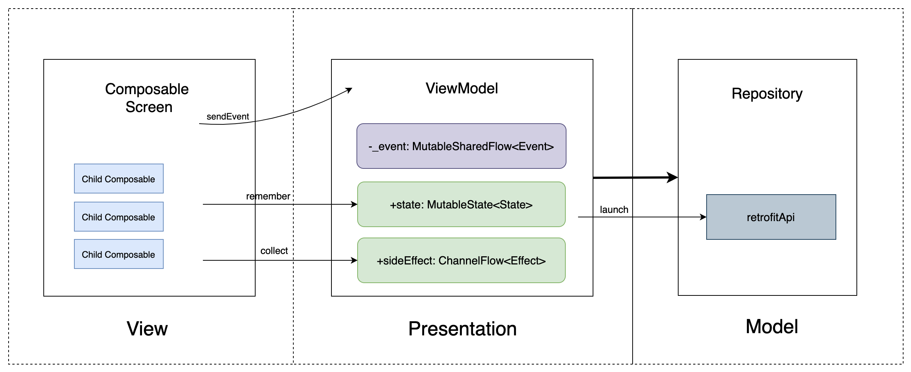

# bluenet

The purpose is to share the Internet capability of one device to the entire Bluetooth LAN.

To make a prototype of a soft bus, or actually, I want my Android phone, iOS phone, ESP32 and these (any device I can think of anyway) to share my Mac's network.
I'll start with bluetooth, and I'll connect all the things that can be connected a whole new network. 
In this new network, the ability to share (such as this device has bluetooth, that device has wifi, another device has a mic, do you want to use each other's capabilities)
it is a bit abstract, and I'm still at the first layer.

## App Architecture
The project is layered traditionally with a View, Presentation, Model separation and presents a MVI inspired from [Yusuf Ceylan's architecture](https://proandroiddev.com/mvi-architecture-with-kotlin-flows-and-channels-d36820b2028d) but adapted to Compose.

Architecture layers:
* View - Composable screens that consume state, apply effects and delegate events.
* ViewModel - [AAC ViewModel](https://developer.android.com/topic/libraries/architecture/viewmodel) that manages and reduces the state of the corresponding screen. Additionally, it intercepts UI events and produces side-effects. The ViewModel lifecycle scope is tied to the corresponding screen composable.
* Model - Repository classes that retrieve data. In a clean architecture context, one should use use-cases that tap into repositories.

- BlueTooth BLE 之 Central 与 Peripheral

Andorid 5.0 之前是无法进行 外围设备开发的，在Android 5.0 API 21 android.bluetooth.le包下，
新增加 Scaner相关类和 Advertiser 相关类。目前最后使用Scanner相关类实现蓝牙扫描。这段时间对蓝牙的学习与理解，对中心设备与周边设备做下面总结

1. Android BLE 周边设备 （Peripheral）可以通过 Advertiser 相关类实现操作；
2. Android BLE 中心设备 （Central）可以通过 Scanner相关类实现蓝牙扫描；
3. Android BLE 建立中心连接的时候，使用 BlueToothDevice#connectGatt() 实现

